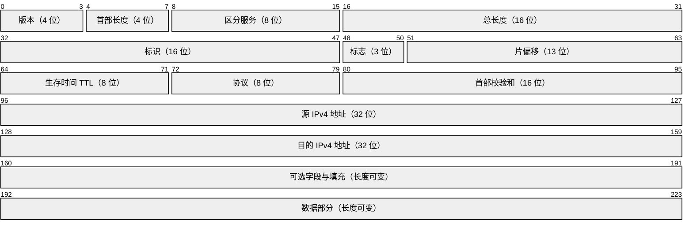

# 子网划分

本节围绕 IPv4 子网划分展开，整理分类地址、子网掩码、网络地址、广播地址、网关以及 CIDR 的计算方法，并结合 UDP 广播理解广播地址的实际用途。

在此基础上，继续梳理以太网帧、MTU、MSS 和 IPv4 数据报首部，为理解网络分层、数据传输与分片机制建立完整联系。

## 为什么划分子网

一个较大的网络可能拥有很多 IP 地址，但实际并不一定全部用得上。子网划分就是把一个较大的地址空间分成多个较小的逻辑网络，便于分组、管理和使用。

基本思路：从原来的**主机位**中借出若干位作为**子网位**。

- 借出的位越多，可划分的子网越多；
- 剩余的主机位越少，每个子网可容纳的主机越少。

## IPv4 地址与分类

IPv4 地址共 32 位，通常写成四段点分十进制数，每段 8 位，取值范围为 `0~255`。

**传统分类地址**

| 类别 | 第一段范围 | 完整范围                      | 默认子网掩码    | 默认前缀 | 用途说明                       |
| ---- | ---------: | ----------------------------- | --------------- | -------: | ------------------------------ |
| A 类 |    `1~127` | `1.0.0.0 ~ 127.255.255.255`   | `255.0.0.0`     |     `/8` | 大量主机、公网                 |
| B 类 |  `128~191` | `128.0.0.0 ~ 191.255.255.255` | `255.255.0.0`   |    `/16` | 大型组织、公司、政府           |
| C 类 |  `192~223` | `192.0.0.0 ~ 223.255.255.255` | `255.255.255.0` |    `/24` | 小型网络、校园网、家庭局域网等 |
| D 类 |  `224~239` | `224.0.0.0 ~ 239.255.255.255` | —               |        — | 组播                           |
| E 类 |  `240~255` | `240.0.0.0 ~ 255.255.255.255` | —               |        — | 保留                           |

**私有地址与特殊地址**

| 类型         | 地址范围         | 说明                                       |
| ------------ | ---------------- | ------------------------------------------ |
| A 类私有地址 | `10.0.0.0/8`     | `10.0.0.0 ~ 10.255.255.255`                |
| B 类私有地址 | `172.16.0.0/12`  | `172.16.0.0 ~ 172.31.255.255`              |
| C 类私有地址 | `192.168.0.0/16` | `192.168.0.0 ~ 192.168.255.255`            |
| 环回地址     | `127.0.0.0/8`    | 最常用的是 `127.0.0.1`，主机访问自己时使用 |
| 保留地址段   | `0.0.0.0/8`      | 不能作为普通主机地址使用                   |

`127.0.0.1` 又称 `localhost`。如果 UDP 客户端和服务端运行在同一台计算机上，可以把目标地址写成 `127.0.0.1` 进行本机测试。

## 子网掩码

**作用**

子网掩码用于区分 IP 地址中的**网络部分**与**主机部分**：

- 掩码中的连续 `1` 对应网络位；
- 后面的连续 `0` 对应主机位；
- IP 地址与子网掩码进行**按位与（AND）**，结果就是网络地址。

**默认掩码示例**

以 `192.168.3.100/24` 为例：

```text
IP 地址：   192.168.3.100
子网掩码： 255.255.255.0
按位与：   192.168.3.0
```

所以：

- 网络地址：`192.168.3.0`
- 主机号：`100`
- 广播地址：`192.168.3.255`
- 可用主机地址：`192.168.3.1 ~ 192.168.3.254`

## 网络地址、广播地址与网关

**网络地址**

同一子网中，所有主机的网络位相同。把主机位全部置为 `0`，得到该子网的**网络地址（子网号）**。网络地址用于标识整个子网，不能直接分配给普通主机。

**广播地址**

保持网络位不变，把主机位全部置为 `1`，得到该子网的**广播地址**。发送到广播地址的数据会被同一广播域内的所有主机接收。

**网关**

网关通常是连接不同网络的路由器接口地址。主机访问其他子网时，数据先交给默认网关，再由路由器转发。

## 非默认子网掩码与 CIDR

CIDR 写法中的 `/n` 表示子网掩码前面连续 `1` 的数量，也就是网络位总数。

示例：

```text
IP 地址：   192.168.3.100
子网掩码： 255.255.255.248
CIDR：      192.168.3.100/29
```

`248` 的二进制为 `11111000`，因此最后一段有 5 个网络位、3 个主机位。该 C 类地址相对于默认 `/24` 借用了 5 位。

计算：

- 步长：`256 - 248 = 8`
- `.100` 所在区间：`96~103`
- 网络地址：`192.168.3.96`
- 广播地址：`192.168.3.103`
- 可用地址：`192.168.3.97 ~ 192.168.3.102`
- 可用主机数：`2^3 - 2 = 6`
- 该 IP 在子网内的主机号：`100 - 96 = 4`

**子网划分的核心公式**

设：

- `x` = 从原主机位中借出的子网位数；
- `y` = 划分后剩余的主机位数。

则：

```text
子网个数 = 2^x
每个子网的地址总数 = 2^y
每个子网的可用主机数 = 2^y - 2
```

减去的 2 个地址分别是：

1. 主机位全为 `0`：网络地址；
2. 主机位全为 `1`：广播地址。

## UDP 广播

**两种广播地址**

- **定向广播（直接广播）**：向某个具体子网的广播地址发送，例如 `/24` 网络中的 `192.168.1.255`
- **有限（受限）广播**：`255.255.255.255`，表示当前本地网络中的所有主机，路由器通常不会转发

**Windows UDP 套接字开启广播**

客户端不能直接向广播地址发送数据，需要先设置 `SO_BROADCAST`：

```cpp
BOOL val = TRUE;
setsockopt(
    s,
    SOL_SOCKET,
    SO_BROADCAST,
    reinterpret_cast<const char*>(&val),
    sizeof(val)
);
```

不设置时直接发送会出现 `sendto error: 10013`；启用 `SO_BROADCAST` 后即可正常广播。

```cpp
// 定向广播示例（假设当前网络为 192.168.1.0/24）
addrTo.sin_addr.S_un.S_addr = inet_addr("192.168.1.255");

// 受限广播
addrTo.sin_addr.S_un.S_addr = inet_addr("255.255.255.255");
```

服务端绑定 `INADDR_ANY` 和相同端口后，可以接收发往该端口的广播数据。广播适合一对多通知，但会占用同一广播域内所有主机的处理资源，不能无限制使用。

## 以太网帧结构、MTU 与 MSS

**以太网帧主要字段**

```text
目的 MAC（6 字节）
+ 源 MAC（6 字节）
+ 类型（2 字节）
+ 数据（46~1500 字节）
+ FCS 帧校验序列（4 字节）
```

不计前导码和帧开始定界符时，以太网帧长度范围为：

```text
最小：6 + 6 + 2 + 46 + 4 = 64 字节
最大：6 + 6 + 2 + 1500 + 4 = 1518 字节
```

**MTU**

MTU（Maximum Transmission Unit）表示链路层一次能够承载的网络层数据最大长度。

普通以太网的 MTU 通常为 `1500` 字节，即以太网帧“数据”字段最大为 1500 字节。

**MSS**

MSS（Maximum Segment Size）表示一个 TCP 报文段中能够承载的最大应用数据长度，不包含 IP 首部和 TCP 首部。

在没有选项时：

```text
MSS = MTU - IPv4 首部 - TCP 首部
    = 1500 - 20 - 20
    = 1460 字节
```

MSS 是 TCP 概念，不能直接套到 UDP 上。

## IPv4 数据报首部

IPv4 首部由固定部分和可变部分组成：

- 最小首部长度：`20` 字节；
- 含选项时最大可到：`60` 字节；
- 数据报由“首部 + 数据”组成，传输时首部在前。



**主要字段**

| 字段            | 位数 | 作用                                                    |
| --------------- | ---: | ------------------------------------------------------- |
| 版本            |    4 | IPv4 中值为 4                                           |
| 首部长度（IHL） |    4 | 以 4 字节为单位，最小值为 5，即 20 字节                 |
| 区分服务        |    8 | 服务质量、优先级等                                      |
| 总长度          |   16 | 整个 IP 数据报长度，即首部加数据                        |
| 标识            |   16 | 分片后用于识别属于同一原始数据报的各片                  |
| 标志            |    3 | 控制是否允许分片、是否还有后续分片                      |
| 片偏移          |   13 | 表示该分片在原数据报中的相对位置                        |
| 生存时间（TTL） |    8 | 每经过一个路由器减 1，减到 0 时丢弃，防止数据报无限循环 |
| 协议            |    8 | 指明上层协议，如 TCP、UDP、ICMP                         |
| 首部校验和      |   16 | 检查 IPv4 首部在传输中是否出错                          |
| 源地址          |   32 | 发送方 IPv4 地址                                        |
| 目的地址        |   32 | 接收方 IPv4 地址                                        |
| 可选字段与填充  | 可变 | 扩展功能，并把首部补齐到 4 字节的整数倍                 |

**可选字段与 TLV**

IPv4 首部按 32 位（4 字节）为一个基本行宽，可选字段加填充后必须是 4 字节的整数倍。

例如选项实际占 5 字节时，需要填充到 8 字节。

在可选字段内部的选项通常按 TLV 组织（现代网络中 IPv4 选项并不常用，大多数普通数据报都没有选项）。

- `T`（Type）：类型；
- `L`（Length）：长度；
- `V`（Value）：值。

把供网络层设备处理的控制信息放入 IP 首部选项，路由器等仅处理到网络层的设备才能读取；普通应用数据仍放在数据部分。

**分片的基本关系**

当 IP 数据报大于链路 MTU 时，可能需要分片。各分片通过“标识”字段关联，通过“标志”和“片偏移”确定是否还有后续分片以及各片原来的位置，接收端再完成重组。

**首部校验、TTL**

- 每个路由器转发前会处理 TTL；TTL 每经过一跳减 1，减到 0 就丢弃数据报，以避免路由环路中的数据报长期占用网络资源；
- IPv4 首部校验和字段是 **16 位**，用于检测首部传输错误。路由器修改 TTL 后需要重新计算首部校验和；校验失败的数据报会被丢弃。
