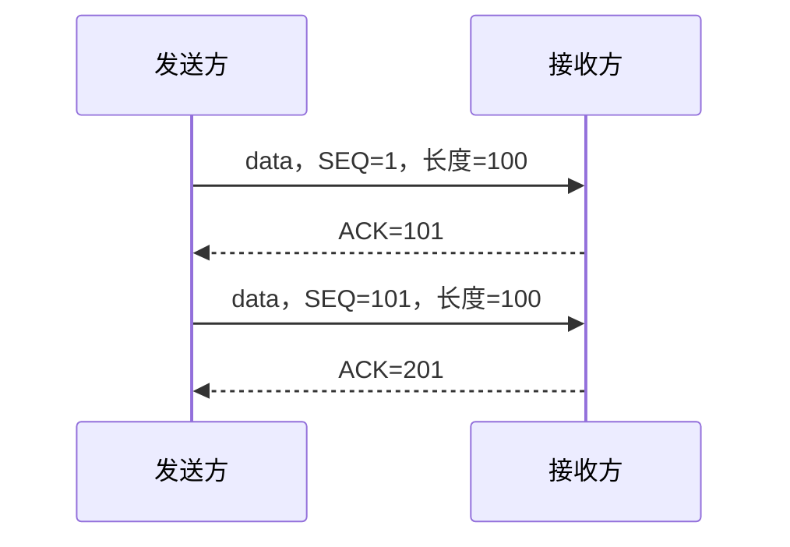
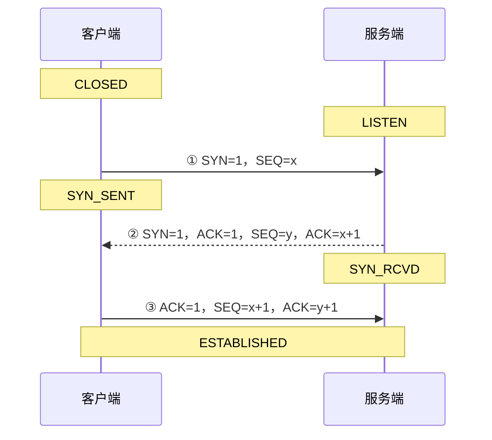
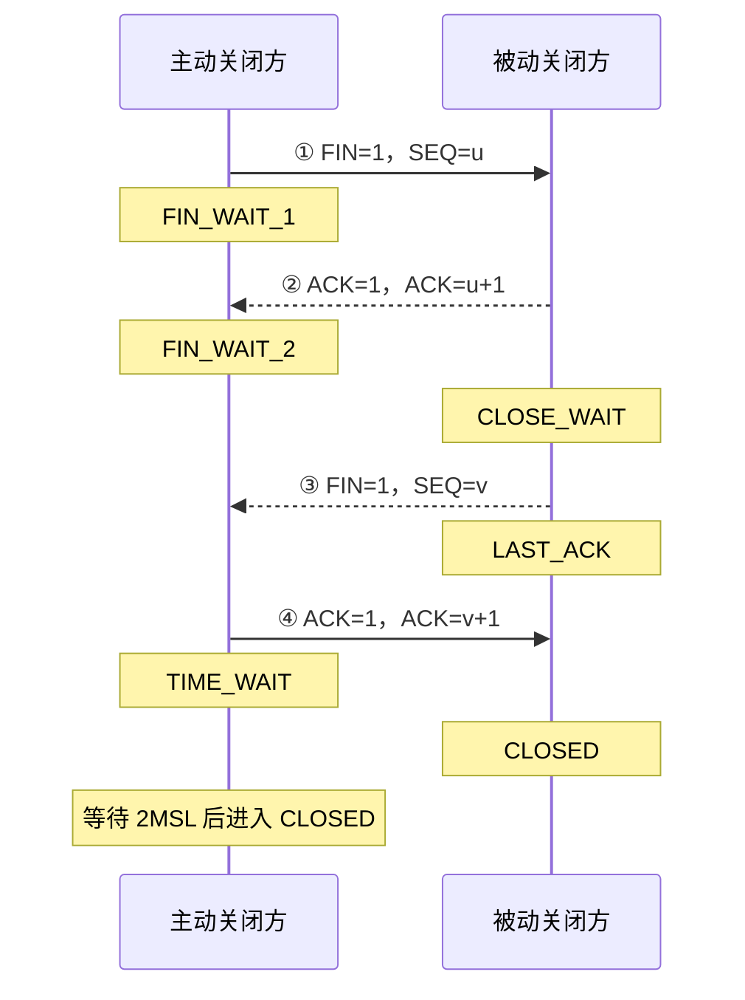

# 基于 TCP 协议的通信实现——客户端 & TCP 协议相关知识 1

本节继续学习 TCP 网络编程，并围绕 TCP 首部、控制标志、MSS、确认应答和超时重传等机制，理解 TCP 如何实现面向连接、可靠的字节流传输。

随后重点梳理三次握手、四次挥手、RTT 与 RTO、累积应答以及滑动窗口和流量控制，为后续分析 TCP 连接状态与传输性能打下基础。

## TCP 的核心特征

- **面向连接**：正式收发数据之前需要先建立连接；
- **可靠**：通过序号、确认应答、超时重传、校验和等机制尽力保证数据正确到达；
- **面向字节流**：TCP 传输的是连续字节流，本身不保留应用程序每次发送数据时的消息边界。

## TCP 报文段首部

**首部整体结构**

TCP 固定首部为 **20 字节**；存在选项时，首部最长可达到 **60 字节**。

```text
  0                   15 16                  31
 +----------------------+----------------------+
 |      源端口（16）      |     目的端口（16）     |
 +----------------------+----------------------+
 |                 序号 SEQ（32）               |
 +---------------------------------------------+
 |                 确认号 ACK（32）             |
 +------+--------+----------+-------------------+
 |首部长|  保留 | 6个标志 |        窗口（16）     |
 |（4） | （6） |  （6） |                      |
 +----------------------+----------------------+
 |      校验和（16）      |     紧急指针（16）    |
 +----------------------+----------------------+
 |          选项（0～40 字节）及填充              |
 +---------------------------------------------+
 |                  TCP 数据                    |
 +---------------------------------------------+
```

**源端口与目的端口**

- 源端口标识发送端进程；
- 目的端口标识接收端进程；
- 端口工作在传输层；
- IP 地址负责找到主机，端口负责找到主机中的具体进程。

**序号 `SEQ`**

主要作用：

- 标识本报文段数据在整个 TCP 字节流中的位置；
- 接收方可据此重新排列乱序到达的数据；
- 帮助发现重复数据和缺失数据；
- 与确认号配合实现可靠传输。

**确认号 `ACK`**

接收方下一次期望收到的字节序号。

例如，发送方发送：

```text
SEQ = 1，数据长度 = 100 字节
```

这些数据所占序号为 `1～100`。接收方正确收到后回复：

```text
ACK = 101
```

含义是：序号 101 之前的数据已经收到，下一次请从 101 开始发送。

因此，一般关系为：

```text
ACK = SEQ + 本次有效数据长度
```

若报文段携带 `SYN` 或 `FIN`，即使没有普通数据，它们也会消耗一个序号。

**首部长度**

首部长度字段用来告诉接收方 TCP 首部到哪里结束、数据从哪里开始。

- 固定首部：20 字节；
- 可变选项：最多 40 字节；
- TCP 首部按 4 字节对齐；
- 选项不满 4 字节倍数时，需要填充。

选项常采用类似 TLV 的组织思路：

```text
Type（类型） + Length（长度） + Value（值）
```

**保留位**

保留位用于协议未来扩展。一般情况下应置为 0。

**窗口 `Window`**

窗口字段用于告诉对方当前接收方还能接收多少字节数据。

发送方根据接收方通告的窗口大小调整发送量，避免接收方缓冲区被写满。这是 TCP **流量控制**的重要基础。

**校验和 `Checksum`**

TCP 校验和用于发现报文段在传输过程中是否发生差错。

- 发送方计算校验和并写入首部；
- 接收方收到后重新计算并比较；
- 校验失败时，该报文段不能作为正确数据交付。

**紧急指针**

紧急指针与 `URG` 标志配合使用。只有 `URG=1` 时，紧急指针字段才有意义，用来指出紧急数据的位置。

## TCP 的六个控制标志位

标志位只有 0 和 1：

- 置 1：启用对应控制含义；
- 置 0：本报文段不使用该控制含义。

| 标志  | 英文含义       | 作用                                     |
| ----- | -------------- | ---------------------------------------- |
| `URG` | Urgent         | 紧急指针有效                             |
| `ACK` | Acknowledgment | 确认号字段有效                           |
| `PSH` | Push           | 希望接收端尽快把数据交给应用程序         |
| `RST` | Reset          | 复位异常连接                             |
| `SYN` | Synchronize    | 同步序号、建立连接                       |
| `FIN` | Finish         | 发送方数据发送完毕，请求关闭该方向的连接 |

**`ACK` 标志与确认号的区别**

- 大写 `ACK`：控制标志，表示确认号字段是否有效；
- 小写 `ack` 或“确认号”：字段中的具体数值。

只有 `ACK=1` 时，确认号字段才应被接收方解释为有效确认。

纯 ACK 报文一般不需要再单独回复一个 ACK，否则会形成无休止的“确认确认”。

## MSS 与 TCP 分段

`MSS` 是 Maximum Segment Size，即一个 TCP 报文段中可携带的最大应用数据量。

`MTU` 是 Maximum Transmission Unit，即链路层一次能够承载的最大网络层数据包长度。

以常见以太网为例：

```text
MTU = 1500 字节
IPv4 固定首部 = 20 字节
TCP 固定首部 = 20 字节
MSS = 1500 - 20 - 20 = 1460 字节
```

实际首部含选项时，可携带的数据量还会相应减少。

## 确认应答与超时重传

**确认应答**

TCP 发送数据后，接收方通过 ACK 告诉发送方数据已经收到。



序号解决“数据属于什么位置”，确认号解决“对方已经收到哪里”。

**超时重传**

发送方发送数据后会启动重传定时器：

1. 在规定时间内收到对应 ACK：继续发送后续数据；
2. 超过规定时间仍未收到 ACK：重新发送未确认数据；
3. 接收方依据序号识别重复报文，避免把同一份数据重复交给应用层。

可能出现两种典型丢失：

**情况 A：数据报文丢失**

发送方收不到 ACK，超时后重传数据。

**情况 B：ACK 丢失**

接收方实际已经收到数据，但回复的 ACK 丢失。发送方仍会超时重传；接收方发现数据重复后丢弃重复内容，并再次回复 ACK。

## TCP 三次握手

三次握手的目标是同步双方初始序号并确认双向通信能力，最终让客户端和服务端都进入 `ESTABLISHED` 状态。

设：

- 客户端初始序号为 `x`；
- 服务端初始序号为 `y`。



**第一次握手**

客户端主动调用 `connect`，发送 `SYN` 报文：

```text
SYN = 1
SEQ = x
```

客户端状态：

```text
CLOSED → SYN_SENT
```

**第二次握手**

服务端处于 `LISTEN` 状态，收到客户端的 `SYN` 后回复：

```text
SYN = 1
ACK = 1
SEQ = y
ACK = x + 1
```

服务端状态：

```text
LISTEN → SYN_RCVD
```

第二个报文把确认和服务端自己的连接请求合并在一起，因此同时带 `SYN` 和 `ACK`。

**第三次握手**

客户端收到服务端响应后，再回复：

```text
ACK = 1
SEQ = x + 1
ACK = y + 1
```

客户端进入 `ESTABLISHED`。服务端收到第三次握手后，也进入 `ESTABLISHED`。

### 为什么不是两次握手

三次握手需要让双方都确认：

- 客户端到服务端的方向可达；
- 服务端到客户端的方向可达；
- 双方都知道对方已经收到自己的同步信息；
- 双方的初始序号已同步。

如果只有两次，客户端知道双向通信基本可达，但服务端不能确认客户端是否收到了自己的 `SYN+ACK`，连接状态可能不一致。

### 为什么不需要四次

建立连接时，服务端对客户端 `SYN` 的确认和服务端自己的 `SYN` 可以放在同一个报文中，即 `SYN+ACK`，所以三次即可。

## TCP 四次挥手

TCP 是全双工通信。关闭一个发送方向，并不意味着另一个方向也已经没有数据，因此断开连接通常需要四次报文交换。

设主动关闭方当前序号为 `u`，被动关闭方当前序号为 `v`。



**第一次挥手**

主动关闭方发送 `FIN`，表示自己的数据已经发送完毕：

```text
ESTABLISHED → FIN_WAIT_1
```

**第二次挥手**

被动关闭方收到 `FIN` 后立即回复 ACK：

```text
被动方：ESTABLISHED → CLOSE_WAIT
主动方收到 ACK：FIN_WAIT_1 → FIN_WAIT_2
```

此时只是主动方到被动方的发送方向关闭。被动方仍可以继续发送尚未发完的数据。

**第三次挥手**

被动关闭方的数据也发送完毕后，再发送自己的 `FIN`：

```text
CLOSE_WAIT → LAST_ACK
```

**第四次挥手**

主动关闭方收到 `FIN` 后回复最后一个 ACK：

```text
FIN_WAIT_2 → TIME_WAIT
```

被动关闭方收到最终 ACK 后进入 `CLOSED`。

### 为什么挥手需要四次

建立连接时，`SYN` 和 `ACK` 可以合并发送；关闭连接时，被动关闭方收到 `FIN` 后可能仍有数据没有发送完，因此：

1. 先回复 ACK，表示已经收到对方的关闭请求；
2. 等自己的数据发送完毕；
3. 再单独发送 FIN；
4. 对方再确认该 FIN。

所以通常需要四次。

**`TIME_WAIT` 与 `2MSL`**

主动关闭方发送最后一个 ACK 后不会立刻释放连接，而会进入 `TIME_WAIT`，等待 `2MSL` 后再进入 `CLOSED`。

`MSL` 是 Maximum Segment Lifetime，即报文段在网络中的最大生存时间。

等待 `2MSL` 的主要意义：

- 若最后一个 ACK 丢失，被动关闭方会重传 FIN；主动关闭方仍能再次回复 ACK；
- 让旧连接中可能残留的报文在网络中自然消失，避免影响之后使用相同四元组建立的新连接。

## RTT 与 RTO

**RTT**

`RTT` 是 Round-Trip Time，即往返时延：

> 从发送端发出数据，到收到接收端确认所经历的总时间。

RTT 主要受以下部分影响：

- 链路传播时间；
- 两端系统处理时间；
- 路由器转发、排队和缓冲时间。

RTT 会随网络状态变化，不是固定常数。

**RTO**

`RTO` 是 Retransmission Timeout，即超时重传时间。

- 发送报文后启动 RTO 定时器；
- RTO 内收到确认：不重传；
- 超过 RTO 仍未确认：重传未确认报文。

实际 TCP 会根据测得的 RTT 及其波动动态估算 RTO，而不是始终固定为某个倍数。

RTO 的取值需要权衡：

- 太小：网络只是稍慢就误判丢包，产生无谓重传；
- 太大：真正丢包时等待过久，降低传输效率。

## 累积应答

TCP 不一定对每一个报文段分别回复一个 ACK，而可以使用累积应答。

例如接收方连续收到：

```text
SEQ 1～100
SEQ 101～200
SEQ 201～300
```

可以直接回复：

```text
ACK = 301
```

其含义是：301 之前的连续字节都已经收到。

累积应答可以减少 ACK 报文数量，但如果中间存在缺口，确认号只能停在缺失位置之前。

## 滑动窗口与流量控制

**为什么需要窗口**

如果每发送一段数据都必须停下来等待 ACK，传输过程会类似“一问一答”，链路利用率较低。

使用滑动窗口后，发送方可在未收到每一个 ACK 前连续发送窗口范围内的多段数据，从而提高效率。

**发送窗口中的区域**

发送端字节序号空间可理解为四个区域：

1. 已发送并已确认；
2. 已发送但尚未确认；
3. 允许发送但尚未发送；
4. 超出当前窗口，暂时不允许发送。

收到新的 ACK 后：

- 左边界向右移动；
- 已确认数据移出窗口；
- 右侧新的序号进入可发送范围；
- 整个窗口向前“滑动”。

**流量控制的目标**

流量控制主要解决：

> 发送方发送过快，而接收方处理不及时，导致接收缓冲区溢出。

接收方在 ACK 中通告自己的接收窗口 `rwnd`。发送方当前未确认数据量不能超过接收方通告的窗口大小。

初始窗口可在建立连接时交换，连接建立后接收方仍会随 ACK 持续更新窗口值。

**流量控制与拥塞控制不同**

- 流量控制：防止接收方来不及处理；
- 拥塞控制：防止网络整体负载过重。

假设初始接收窗口为 360 字节：

| 步骤 | 发送内容            | 接收方确认 | 通告窗口 |
| ---- | ------------------- | ---------- | -------- |
| 1    | `SEQ=1`，长度 140   | `ACK=141`  | 260      |
| 2    | `SEQ=141`，长度 180 | `ACK=321`  | 80       |
| 3    | `SEQ=321`，长度 80  | `ACK=401`  | 0        |

过程解释：

1. 接收方最初还能接收 360 字节；
2. 收到 140 字节后，应用程序只取走 40 字节，缓冲区净增加 100 字节，因此剩余窗口为 260；
3. 再收到 180 字节且应用程序没有及时读取，窗口缩小到 80；
4. 再收到 80 字节后缓冲区写满，通告 `Window=0`；
5. 发送方看到零窗口后暂停发送；
6. 当接收端应用程序继续读取数据、缓冲区腾出空间后，接收方重新通告非零窗口，发送方才能继续发送。

窗口大小体现的是接收方的实时处理能力，因此流量控制属于端到端的“接收方保护机制”。

**零窗口后的恢复**

当接收方通告 `Window=0` 后：

1. 发送方暂停普通数据发送；
2. 接收方缓冲区重新出现空间时，应通告新的非零窗口；
3. 如果这次窗口更新报文在网络中丢失，发送方不能永远等待；
4. 发送方可定期发送窗口探测报文，询问接收方当前窗口；
5. 接收方回复最新窗口值，窗口恢复后继续传输。

规范中，这一过程由持续计时器和零窗口探测机制完成。
